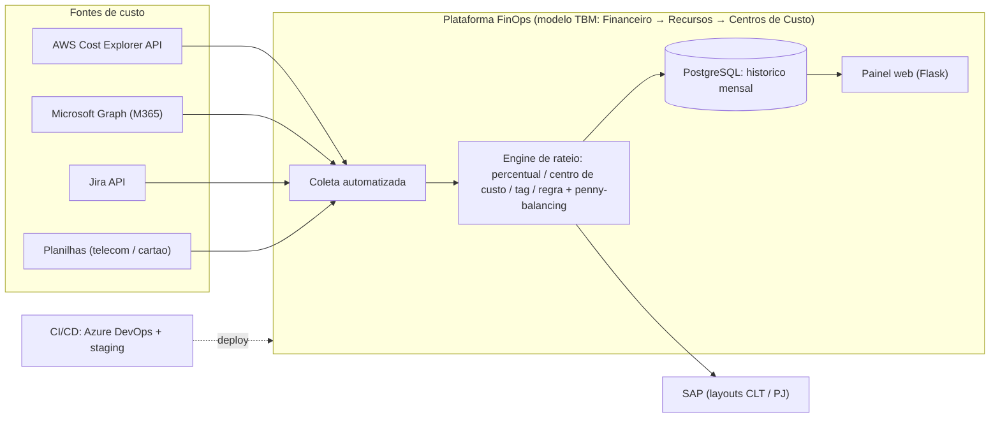

# Estudo de Caso 01: Plataforma de FinOps (modelo TBM)
*Governança e rateio de custos de TI multi-cloud · estudo de caso anonimizado*

## Contexto
Empresa de tecnologia (cerca de 490 usuários) com custos de TI dispersos entre cloud (AWS, Azure), licenças (Microsoft 365, Atlassian), **ferramentas de IA (LLMs)**, telecom, segurança e SaaS: sem visibilidade de quanto cada centro de custo e cada projeto/cliente consumia.

## Desafio
Dar transparência ao gasto de cerca de R$ 1 milhão/ano e habilitar redução de custo, com rateio que **batesse exatamente com a fatura** e fosse importável no ERP.

## Solução / Arquitetura
Plataforma própria seguindo o framework **TBM (Technology Business Management)** em 3 camadas (Financeiro → Recursos de TI → Centros de Custo):
- **Coleta automatizada** de custos via APIs (AWS Cost Explorer, Microsoft Graph, Jira) + upload de planilhas para categorias manuais (telecom, cartão).
- **Engine de rateio** por percentual, centro de custo fixo, tag de cloud e regra manual; com *penny-balancing* para conciliar centavos com a fatura.
- **Persistência** em PostgreSQL com histórico mensal; **painel web** (Flask) para consulta.
- **Saída integrada ao SAP** (layouts CLT/PJ); pipeline **CI/CD** em Azure DevOps com staging.

## Stack
Python (Flask) · PostgreSQL · AWS Cost Explorer API · Microsoft Graph API · Jira API · SAP (integração) · Docker · Azure DevOps.

## Arquitetura (diagrama)

## Critérios de segurança
- **Credenciais via variável de ambiente / cofre** (Azure DevOps secrets); nada de segredo em código.
- **Painel atrás de autenticação corporativa** (SSO/SAML); acesso por papel.
- **Menor privilégio nas chaves de cloud**: somente leitura de billing/Cost Explorer.
- **Sem PII**: dados de custo agregados por centro de custo e projeto.
- **CI/CD com staging e revisão** antes de produção (pipeline versionado).
- **Trilha de auditoria** das regras de rateio e do histórico mensal (versionamento).

## Resultado
- **19% de redução** de custo de TI recorrente (≈ R$ 180–230 mil/ano) via racionalização de ferramentas redundantes e renegociação de contratos.
- Rateio mensal de **49 centros de custo** e **42 projetos** com conciliação automática.
- Visibilidade que transformou decisões de custo de reativas em orientadas a dado.

## Meu papel
Concepção, arquitetura, desenvolvimento e operação contínua da plataforma; definição das regras de rateio com a controladoria; negociação das otimizações de contrato.

---
*A engenharia de ingestão multi-fornecedor (nuvem, licenças, IA/LLMs, telecom por linha), a normalização num fato canônico e o export padronizado para o ERP com conciliação exata à fatura estão detalhados no [caso 06](06-rateio-multifornecedor-erp.md).*
