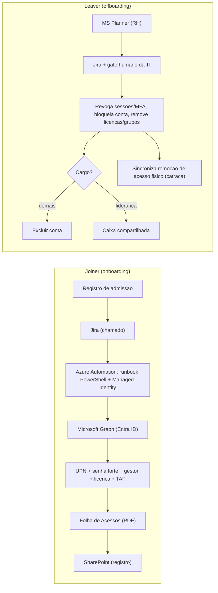

# Estudo de Caso 02: Automação do Ciclo de Vida de Identidade
*Onboarding e offboarding no Microsoft Entra ID · estudo de caso anonimizado*

## Contexto
Provisionamento e desprovisionamento de usuários feitos manualmente, com risco de erro, atraso e — no desligamento — de acesso residual (lógico e físico).

## Desafio
Automatizar o ciclo de vida completo (joiner/leaver) com **governança e segregação de funções**, garantindo conformidade ISO 27001 e trilha de auditoria.

## Solução / Arquitetura
- **Onboarding:** leitura do e-mail/registro de admissão → abertura de chamado no Jira → provisionamento no Entra ID via **Azure Automation (runbook PowerShell + Managed Identity)** e **Microsoft Graph** → criação de UPN com tratamento de colisão, senha forte, atribuição de gestor e licença, emissão de TAP → geração de "Folha de Acessos" (documento → PDF) → registro centralizado em SharePoint.
- **Offboarding:** integração com o board de RH (MS Planner) → chamado no Jira com **gate humano da TI** (validação antes de ação destrutiva) → revogação de sessões/tokens, bloqueio de conta, remoção de licenças/grupos/MFA, decisão entre exclusão e caixa compartilhada conforme o cargo, com **preservação de dados (litigation hold)** quando exigido → **sincronização da remoção de acesso físico** (controle de catraca/facial).

## Stack
Azure Automation · Microsoft Graph API · PowerShell 7 · Jira Service Management · Power Automate · SharePoint Online.

## Arquitetura (diagrama)

## Critérios de segurança
- **Managed Identity** no runbook: sem segredo em código.
- **Segregação de funções**: ação destrutiva só após **gate humano da TI**.
- **Menor privilégio** nos escopos do Microsoft Graph (apenas os necessários).
- **Trilha de auditoria** nativa (Entra/Jira/SharePoint): evidência para ISO 27001.
- Offboarding cobre **acesso lógico e físico** (sem acesso residual).
- Senha forte + TAP; sessões/tokens revogados no desligamento.

## Resultado
- Provisionamento padronizado e auditável, eliminando passos manuais e erros de configuração.
- Offboarding com segregação de funções, reduzindo risco de acesso residual.
- Trilha de auditoria nativa: evidência direta para a ISO 27001.

## Meu papel
Desenho do fluxo, automação (runbooks e regras), integração entre Graph, Jira, SharePoint e controle de acesso físico, e definição das regras de negócio por categoria de colaborador.
