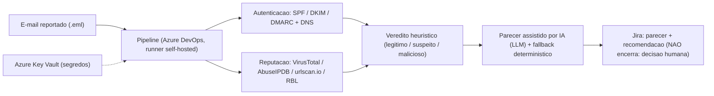

# Estudo de Caso 03: Agente de IA para Triagem de Phishing
*Security Operations assistida por IA, com human-in-the-loop · estudo de caso anonimizado*

## Contexto
E-mails suspeitos reportados por colaboradores chegavam à equipe de segurança para triagem manual: processo lento e dependente de analista para cada caso.

## Desafio
Acelerar a triagem com análise técnica consistente, **sem abrir mão da decisão humana** e **sem expor o conteúdo dos e-mails** a serviços externos (privacidade by design).

## Solução / Arquitetura
Agente autônomo acionado por pipeline (Azure DevOps, runner self-hosted) que, a partir do `.eml` reportado:
- valida **autenticação** (SPF/DKIM/DMARC) e registros DNS;
- checa **reputação** de IP, URLs e hashes de anexo em **VirusTotal, AbuseIPDB, urlscan.io** e RBLs;
- calcula um **veredito heurístico** (legítimo / suspeito / malicioso) por pontuação ponderada;
- redige um **parecer técnico assistido por IA (LLM)**, com *fallback* determinístico se a IA estiver indisponível;
- publica a análise no chamado (Jira) com recomendação ao analista: **sem encerrar o ticket** (decisão é humana).

Segredos em cofre (Key Vault); orçamento de APIs respeitado (dedupe, rate-limit); execução *dry-run* por padrão. **Resiliência**: *retry* com *backoff* para indisponibilidade transitória da IA, *fallback* determinístico e *chunking* de parecer longo em múltiplos comentários (respeitando o limite do campo).

## Stack
Python · LLM (parecer) · VirusTotal/AbuseIPDB/urlscan.io APIs · Azure DevOps Pipelines · Azure Key Vault · Jira REST.

## Arquitetura (diagrama)

## Critérios de segurança
- **Privacidade by design**: sem upload do conteúdo do e-mail a serviços externos.
- **Human-in-the-loop**: o agente não encerra o ticket; a decisão é do analista.
- **Segredos em Key Vault**; execução **dry-run** por padrão.
- **Rate-limit e dedupe** nas APIs de inteligência de ameaças (orçamento respeitado).
- **Veredito explicável** (pontuação ponderada) e trilha de auditoria por etapa.

## Resultado
- Triagem de segurança mais rápida e padronizada, com parecer técnico pronto para o analista decidir.
- Privacidade preservada (sem upload de conteúdo do e-mail) e trilha de auditoria por etapa.
- Melhora na cultura de reporte, com retorno cordial ao colaborador.

## Meu papel
Arquitetura do agente, integração das fontes de inteligência de ameaças, lógica de pontuação, prompt e governança do *human-in-the-loop*.

---
*Este agente é um de três de uma frota de segurança (phishing, firewall/NGFW e endpoint/EDR) com motor de IA comum, comparação mês-a-mês e automação de ciclo de vida de chamados — detalhada no [caso 07](07-frota-agentes-aiops-seguranca.md).*
