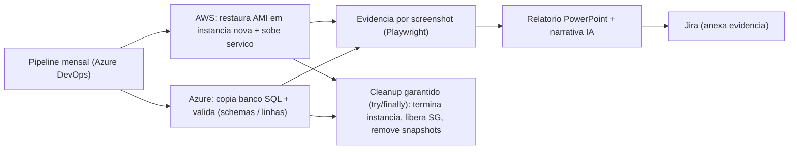

# Estudo de Caso 04: Validação Automatizada de Backup / DR
*Confiabilidade (SRE) em ambiente híbrido AWS + Azure · estudo de caso anonimizado*

## Contexto
Backups existiam, mas a **validação de restauração** (a prova de que o backup funciona) era manual, esporádica e consumia horas: risco clássico de "backup que não restaura".

## Desafio
Comprovar **RTO/RPO** com um teste de restauração recorrente, automatizado, com evidência auditável e **sem deixar recursos órfãos** gerando custo.

## Solução / Arquitetura
Agente mensal orquestrado por pipeline que:
- **AWS:** restaura uma AMI em instância nova, sobe o serviço e captura **evidência por screenshot** (Playwright);
- **Azure:** copia o banco (SQL) e valida integridade (schemas e contagem de linhas);
- monta um **relatório em PowerPoint** com as evidências e narrativa assistida por IA;
- anexa o resultado ao chamado (Jira);
- executa **cleanup garantido** (`try/finally`): encerra instâncias, libera security groups e remove snapshots/cópias.

## Stack
Python · boto3 (AWS) · PowerShell (Azure SQL) · Playwright · python-pptx · Azure DevOps Pipelines · Jira REST.

## Arquitetura (diagrama)

## Critérios de segurança
- **Não-destrutivo**: lê da origem e opera em **cópias/instâncias efêmeras**.
- **Cleanup transacional** (`try/finally`): zero recurso órfão e custo residual.
- **Evidência carimbada e auditável**: RTO/RPO comprovável.
- **Menor privilégio** por conta de cloud; segredos fora do código.
- **Validação de integridade** (schema + contagem de linhas) antes de aprovar.

## Resultado
- Validação de recuperação que antes era manual (horas) passou a rodar de forma automática e recorrente, com evidência carimbada.
- Confiança comprovável em RTO/RPO: o que auditoria e clientes exigem.
- Zero recurso órfão graças ao cleanup transacional.

## Meu papel
Arquitetura do agente híbrido, scripts de restauração/validação, captura de evidência, geração do relatório e a disciplina de cleanup garantido.

---
*Complementa o **monitoramento centralizado** do ambiente (Zabbix/Grafana): o monitoramento previne e alerta; a validação de restauração **prova a recuperação**, fechando o ciclo de confiabilidade.*
