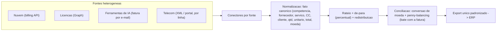

# Estudo de Caso 06: Rateio Multi-Fornecedor com Export Padronizado para ERP
*Normalização e conciliação de custos de fontes heterogêneas · estudo de caso anonimizado*

## Contexto
A prática de FinOps (ver [caso 01](01-finops-tbm.md)) cresceu para dezenas de fontes de custo com formatos totalmente diferentes: APIs de nuvem, portais de licença, faturas de ferramentas de **IA (LLMs)** que chegam apenas por e-mail, e telecom com XML/portal **por linha**. Cada fonte tinha unidade, moeda e granularidade próprias, e o export para o ERP variava de fornecedor para fornecedor — o fechamento manual não escalava.

## Desafio
Ingerir fontes heterogêneas, **normalizar num modelo único**, ratear por centro de custo/cliente e **exportar num layout único para o ERP**, com conciliação **exata à fatura** — sem retrabalho a cada novo fornecedor.

## Solução / Arquitetura
- **Conectores por fonte**: API de nuvem (billing), Microsoft Graph (licenças), REST de gestão de trabalho, *parsing* de fatura por e-mail (ferramentas de IA) e XML/portal de telecom por linha.
- **Fato canônico único** (modelo `fact_allocation`): competência · fornecedor · serviço · centro de custo · cliente/projeto · quantidade · unitário · total · moeda.
- **De-para por percentual** (join centro de custo + cliente) e **regras de redistribuição**: conta sem mapeamento → fila de conferência; centro de custo zerado → redistribui proporcionalmente.
- **Conversão de moeda** quando aplicável (US$ → R$) e **penny-balancing** para bater exatamente com a fatura.
- **Export único padronizado para o ERP** (mesmo layout de colunas para todos os fornecedores), pronto para importação.

## Stack
Python · PostgreSQL · APIs de nuvem / Microsoft Graph / gestão de trabalho · parsing de e-mail e XML · ERP (layout único de importação) · Azure DevOps.

## Arquitetura (diagrama)

## Critérios de segurança
- **Segredos em cofre**; chaves com **leitura mínima** de billing.
- **Sem PII**: dados agregados por centro de custo, cliente e projeto.
- **Trilha de auditoria por competência** (histórico e versionamento das regras).
- **Conciliação verificável**: total exportado = total da fatura (diferença zero).

## Resultado
- **Onboarding de um novo fornecedor em horas**, não dias: novo conector + mapa de centro de custo e o fluxo herda normalização, rateio e export.
- **Export único para o ERP** eliminou a variação por fornecedor e o retrabalho de fechamento.
- **Conciliação exata à fatura** em todas as competências — base confiável para o rateio de ~R$ 1 milhão/ano (49 centros de custo, 42 projetos).

## Meu papel
Modelagem do fato canônico, desenvolvimento dos conectores, motor de de-para/redistribuição, padronização do export para o ERP e a disciplina de conciliação à fatura.
