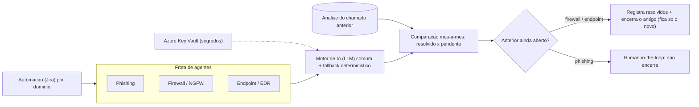

# Estudo de Caso 07: Frota de Agentes de IA para AIOps de Segurança
*Três agentes autônomos, comparação mês-a-mês e automação do ciclo de vida de chamados · estudo de caso anonimizado*

## Contexto
Diferentes domínios de segurança exigiam análise técnica recorrente: triagem de phishing (ver [caso 03](03-agente-ia-phishing.md)), postura de **firewall (NGFW)** e **endpoint (EDR)**. Cada domínio gerava chamados que se acumulavam e se **repetiam mês a mês**, sem memória do que já havia sido tratado.

## Desafio
Escalar a análise de segurança em múltiplos domínios **sem ampliar a equipe**, com pareceres consistentes, **evitando chamados duplicados/obsoletos** — e mantendo a decisão humana onde o risco exige.

## Solução / Arquitetura
- **Três agentes** (phishing, firewall/NGFW, endpoint/EDR) sobre um **motor de IA (LLM) comum** e **cofre de segredos compartilhado**; cada agente é acionado por automação (Jira) e tem pipeline próprio.
- **Comparação mês-a-mês**: o agente lê a **análise estruturada do chamado anterior** do mesmo ambiente para identificar **o que foi resolvido e o que segue pendente** — dando continuidade em vez de recomeçar do zero.
- **Automação do ciclo de vida do chamado**: ao abrir um novo chamado com o anterior (mesmo ambiente) ainda aberto, o agente registra as **ações resolvidas**, **encerra o chamado antigo** e deixa apenas o novo (firewall/endpoint). No **phishing**, mantém **human-in-the-loop** (não encerra: decisão do analista).
- **Resiliência**: *retry* com *backoff* para indisponibilidade transitória da IA; **fallback determinístico**; **chunking** de parecer longo em múltiplos comentários; *timeouts* e orçamento de tokens.

## Stack
Python · IA (LLM) · Azure DevOps Pipelines · Azure Key Vault · Jira REST / Automation.

## Arquitetura (diagrama)

## Avaliação e verificação (o núcleo de qualidade)
O que separa a frota de um "resumidor de LLM" é a **régua de avaliação ancorada em contexto e frameworks** — não no palpite do modelo:
- **Firewall/NGFW — calibração por direção de tráfego**: regras `any/any` classificadas pelo sentido (entrada pelo perímetro = **crítico**; saída/interna = **alto**), e inspeção sinalizada **apenas quando o tráfego cruza o perímetro** — reduz ruído sem perder o que importa.
- **Endpoint/EDR — frameworks de referência**: achados mapeados a **MITRE ATT&CK · CIS · NIST**, com foco nos incidentes **não-bloqueados** (os que exigem ação) e priorização por severidade. Régua validada contra **centenas de incidentes reais**.
- **Phishing — evidência multi-fonte**: autenticação (SPF/DKIM/DMARC) + reputação em múltiplas bases, com **fontes de baixa confiança que não pontuam** (evitam falso-positivo).
- **Controle de falso-positivo transversal**: allowlist de hosts de desenvolvimento, regra de "nunca classificar vazio como legítimo" e **veredito explicável** por pontuação ponderada.
- **Estado longitudinal**: na comparação mês-a-mês, cada item recebe um estado — **sanado / persiste / novo** — dando continuidade auditável entre competências.

## Critérios de segurança
- **Segredos em Key Vault**; **menor privilégio** por agente.
- **Human-in-the-loop no phishing**: o agente recomenda, o analista decide.
- **Transições de status idempotentes e verificadas** (checa o estado antes/depois + *retry*): sem encerrar chamado errado.
- **Trilha de auditoria** por etapa e por competência; veredito explicável.

## Resultado
- Análise de segurança **recorrente e padronizada em três domínios** sem ampliar a equipe.
- Fila de chamados sempre com o **estado mais recente** (sem duplicados nem tickets obsoletos), com histórico do que foi resolvido.
- Pareceres **resilientes a instabilidade da IA** (retry/fallback), entregues mesmo sob indisponibilidade transitória.

## Meu papel
Arquitetura da frota, motor de IA comum e governança do *human-in-the-loop*, lógica de comparação mês-a-mês, encerramento seguro de chamado (verificação de status + retry) e os padrões de resiliência.
